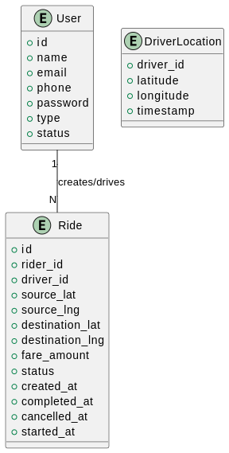

# uber-lite-backend

## Functional Features

### User Journeys and Requirements

#### **Rider Journey: Booking a Ride**
1. **Setting Up the Trip**:
   - The rider should be able to define a destination and get a fare estimation from Uber.
   - The rider should be able to choose a payment method for the trip.
   
2. **Confirming the Ride**:
   - The rider should be able to confirm the trip with the defined destination and fare.

3. **Waiting for Matching**:
   - The rider should be matched with the nearest available driver.
   - The driver should be notified of the ride request and have the ability to accept or deny it within 10 seconds.

4. **Tracking the Driver**:
   - The rider should be able to track the driver's real-time location until pickup and during the ride.

5. **Completing the Ride**:
   - The rider should have the ability to rate the driver after the trip.

#### **Driver Journey: Accepting and Completing a Ride**
1. **Setting Availability**:
   - The driver should be able to set their status to "available" to start receiving ride requests.

2. **Receiving Ride Requests**:
   - The driver should be notified of a ride request with relevant details (e.g., pickup location) and have the ability to accept or deny the request within 10 seconds.

3. **Providing Location Updates**:
   - The driver's location should be tracked in real time to enable efficient matching and rider tracking.

4. **Handling the Ride**:
   - The driver should only be allowed to handle one ride at a time, avoiding conflicts from multiple requests.

5. **Completing the Ride**:
   - The driver should have the ability to mark the ride as completed and provide feedback about the rider.

---

### Summarized Functional Features

#### Core
- The rider can define a destination and confirm a trip with a fare estimation.
- The system should match the rider with the nearest driver efficiently.
- The driver should receive ride requests and be able to accept/deny within 10 seconds.
- The driver’s real-time location should be tracked and updated throughout the trip.
- Drivers should handle only one trip at a time, ensuring focus and efficiency.

#### Secondary
- Riders can select a vehicle type that suits their preferences, while drivers can classify their vehicles.
- Riders and drivers can provide feedback (ratings) after the trip.

---

## Non-Functional Features

### Core
- The system must ensure fast and accurate matching between riders and drivers, minimizing waiting times.
   - Efficient Driver Search: Quickly find the nearest available driver using real-time location data.  
   - Limit Driver Response Time: Ensure drivers respond to ride requests within a set time (e.g., 10 seconds) to avoid delays.
- Location data should be handled in a way that optimizes performance with quick, meaningful writes, such as adapting update frequency based on driver speed or proximity to the rider.


Here’s the updated **README** section with the requested structure:

---

## Entities



### User
- `id`
- `name`
- `role`
- `status`

### Ride
- `id`
- `fare_id`
- `user_id`
- `driver_id`
- `source`
- `destination`
- `status`

### Fare
- `id`
- `ride_id`
- `fare_estimation`

### Location
- `user_id`
- `longitude`
- `latitude`
  
## APIs


### Update Driver Availability
- **Endpoint**: `/drivers/{driverId}`
- **Method**: POST
- **Request Body**:
  ```json
  {
      "driverId": "<driver_id>",
      "status": "available" | "unavailable"
  }
  ```

### Get Fare Estimation
- **Endpoint**: `/fares`
- **Method**: POST
- **Request Body**:
  ```json
  {
      "source": "<source_location>",
      "destination": "<destination_location>"
  }
  ```

### Confirm the Ride
- **Endpoint**: `/rides/confirm`
- **Method**: POST
- **Request Body**:
  ```json
  {
      "rideId": "<ride_id>"
  }
  ```

### Accept/Deny a Ride Request
- **Endpoint**: `/rides/{rideId}`
- **Method**: PUT | PATCH
- **Request Body**:
  ```json
  {
      "response": "accept" | "deny"
  }
  ```

### Update Driver Location
- **Endpoint**: `/drivers/location`
- **Method**: POST
- **Request Body**:
  ```json
  {
      "longitude": "<driver_longitude>",
      "latitude": "<driver_latitude>"
  }
  ```

### Get Driver Location [2 options]
- **Short Polling**
  - **Endpoint**: `/rides/{rideId}/driver-location`
  - **Method**: GET

- **Server-Sent Events (SSE)**
  - **Endpoint**: `/rides/{rideId}/driver-location-stream`
  - **Method**: GET

### Complete Ride
- **Endpoint**: `/rides/{rideId}/complete`
- **Method**: POST
- **Request Body**:
  ```json
  {
      "driverId": "<driver_id>",
      "riderId": "<rider_id>"
  }
  ```